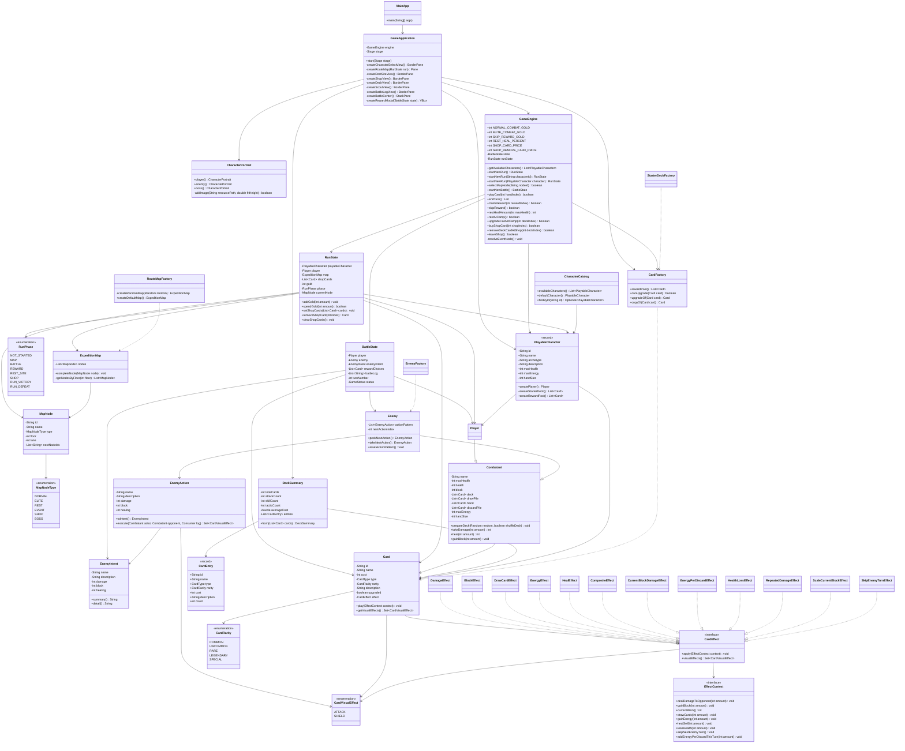

# 项目 UML 图

```mermaid
classDiagram
    class MainApp {
        +main(String[] args)
    }

    class GameApplication {
        -GameEngine engine
        -Stage stage
        +start(Stage stage)
        -createCharacterSelectView() BorderPane
        -createRouteMap(RunState run) Pane
        -createRestSiteView() BorderPane
        -createShopView() BorderPane
        -createDeckView() BorderPane
        -createScoutView() BorderPane
        -createBattleLogView() BorderPane
        -createBattleCenter() StackPane
        -createRewardModal(BattleState state) VBox
    }

    class CharacterPortrait {
        +player() CharacterPortrait
        +enemy() CharacterPortrait
        +boss() CharacterPortrait
        -addImage(String resourcePath, double fitHeight) boolean
    }

    class GameEngine {
        +int NORMAL_COMBAT_GOLD
        +int ELITE_COMBAT_GOLD
        +int SKIP_REWARD_GOLD
        +int REST_HEAL_PERCENT
        +int SHOP_CARD_PRICE
        +int SHOP_REMOVE_CARD_PRICE
        -BattleState state
        -RunState runState
        +getAvailableCharacters() List~PlayableCharacter~
        +startNewRun() RunState
        +startNewRun(String characterId) RunState
        +startNewRun(PlayableCharacter character) RunState
        +selectMapNode(String nodeId) boolean
        +startNewBattle() BattleState
        +playCard(int handIndex) boolean
        +endTurn() List
        +claimReward(int rewardIndex) boolean
        +skipReward() boolean
        +restHealAmount(int maxHealth) int
        +restAtCamp() boolean
        +upgradeCardAtCamp(int deckIndex) boolean
        +buyShopCard(int shopIndex) boolean
        +removeDeckCardAtShop(int deckIndex) boolean
        +leaveShop() boolean
        -resolveEventNode() void
    }

    class BattleState {
        -Player player
        -Enemy enemy
        -EnemyIntent enemyIntent
        -List~Card~ rewardChoices
        -List~String~ battleLog
        -int turnNumber
        -GameStatus status
    }

    class RunState {
        -PlayableCharacter playableCharacter
        -Player player
        -ExpeditionMap map
        -List~Card~ shopCards
        -int gold
        -RunPhase phase
        -MapNode currentNode
        +addGold(int amount) void
        +spendGold(int amount) boolean
        +setShopCards(List~Card~ cards) void
        +removeShopCard(int index) Card
        +clearShopCards() void
    }

    class RunPhase {
        <<enumeration>>
        NOT_STARTED
        MAP
        BATTLE
        REWARD
        REST_SITE
        SHOP
        RUN_VICTORY
        RUN_DEFEAT
    }

    class PlayableCharacter {
        <<record>>
        +String id
        +String name
        +String archetype
        +String description
        +int maxHealth
        +int maxEnergy
        +int handSize
        +createPlayer() Player
        +createStarterDeck() List~Card~
        +createRewardPool() List~Card~
    }

    class CharacterCatalog {
        +availableCharacters() List~PlayableCharacter~
        +defaultCharacter() PlayableCharacter
        +findById(String id) Optional~PlayableCharacter~
    }

    class ExpeditionMap {
        -List~MapNode~ nodes
        +completeNode(MapNode node) void
        +getNodesByFloor(int floor) List~MapNode~
    }

    class MapNode {
        -String id
        -String name
        -MapNodeType type
        -int floor
        -int lane
        -List~String~ nextNodeIds
    }

    class MapNodeType {
        <<enumeration>>
        NORMAL
        ELITE
        REST
        EVENT
        SHOP
        BOSS
    }

    class Combatant {
        -String name
        -int maxHealth
        -int health
        -int block
        -List~Card~ deck
        -List~Card~ drawPile
        -List~Card~ hand
        -List~Card~ discardPile
        -int maxEnergy
        -int handSize
        +prepareDeck(Random random, boolean shuffleDeck) void
        +takeDamage(int amount) int
        +heal(int amount) int
        +gainBlock(int amount) void
    }

    class Player

    class Enemy {
        -List~EnemyAction~ actionPattern
        -int nextActionIndex
        +peekNextAction() EnemyAction
        +takeNextAction() EnemyAction
        +resetActionPattern() void
    }

    class EnemyAction {
        -String name
        -String description
        -int damage
        -int block
        -int healing
        +toIntent() EnemyIntent
        +execute(Combatant actor, Combatant opponent, Consumer log) Set~CardVisualEffect~
    }

    class EnemyIntent {
        -String name
        -String description
        -int damage
        -int block
        -int healing
        +summary() String
        +detail() String
    }

    class Card {
        -String id
        -String name
        -int cost
        -CardType type
        -CardRarity rarity
        -String description
        -boolean upgraded
        -CardEffect effect
        +play(EffectContext context) void
        +getVisualEffects() Set~CardVisualEffect~
    }

    class CardFactory {
        +rewardPool() List~Card~
        +canUpgrade(Card card) boolean
        +upgradeOf(Card card) Card
        +copyOf(Card card) Card
    }

    class DeckSummary {
        -int totalCards
        -int attackCount
        -int skillCount
        -int tacticCount
        -double averageCost
        -List~CardEntry~ entries
        +from(List~Card~ cards) DeckSummary
    }

    class CardEntry {
        <<record>>
        +String id
        +String name
        +CardType type
        +CardRarity rarity
        +int cost
        +String description
        +int count
    }

    class CardEffect {
        <<interface>>
        +apply(EffectContext context) void
        +visualEffects() Set~CardVisualEffect~
    }

    class CardVisualEffect {
        <<enumeration>>
        ATTACK
        SHIELD
    }

    class CardRarity {
        <<enumeration>>
        COMMON
        UNCOMMON
        RARE
        LEGENDARY
        SPECIAL
    }

    class EffectContext {
        <<interface>>
        +dealDamageToOpponent(int amount) void
        +gainBlock(int amount) void
        +currentBlock() int
        +drawCards(int amount) void
        +gainEnergy(int amount) void
        +healSelf(int amount) void
        +loseHealth(int amount) void
        +skipNextEnemyTurn() void
        +addEnergyPerDiscardThisTurn(int amount) void
    }

    class DamageEffect
    class BlockEffect
    class DrawCardEffect
    class EnergyEffect
    class HealEffect
    class CompositeEffect
    class CurrentBlockDamageEffect
    class EnergyPerDiscardEffect
    class HealthLossEffect
    class RepeatedDamageEffect
    class ScaleCurrentBlockEffect
    class SkipEnemyTurnEffect
    class StarterDeckFactory
    class EnemyFactory
    class RouteMapFactory {
        +createRandomMap(Random random) ExpeditionMap
        +createDefaultMap() ExpeditionMap
    }

    MainApp --> GameApplication
    GameApplication --> GameEngine
    GameApplication --> CharacterPortrait
    GameApplication --> DeckSummary
    GameApplication --> PlayableCharacter
    GameApplication --> CardFactory
    GameEngine --> BattleState
    GameEngine --> RunState
    GameEngine --> PlayableCharacter
    GameEngine --> CardFactory
    BattleState --> Player
    BattleState --> Enemy
    BattleState --> EnemyIntent
    BattleState --> Card
    RunState --> Player
    RunState --> PlayableCharacter
    RunState --> ExpeditionMap
    RunState --> MapNode
    RunState --> RunPhase
    RunState --> Card
    ExpeditionMap --> MapNode
    MapNode --> MapNodeType
    Player --|> Combatant
    Enemy --|> Combatant
    Enemy --> EnemyAction
    EnemyAction --> EnemyIntent
    EnemyAction --> CardVisualEffect
    Combatant --> Card
    Card --> CardRarity
    Card --> CardEffect
    Card --> CardVisualEffect
    DeckSummary --> Card
    DeckSummary --> CardEntry
    PlayableCharacter --> Player
    PlayableCharacter --> Card
    CharacterCatalog --> PlayableCharacter
    CardEffect --> EffectContext
    CardEffect --> CardVisualEffect
    DamageEffect ..|> CardEffect
    BlockEffect ..|> CardEffect
    DrawCardEffect ..|> CardEffect
    EnergyEffect ..|> CardEffect
    HealEffect ..|> CardEffect
    CompositeEffect ..|> CardEffect
    CurrentBlockDamageEffect ..|> CardEffect
    EnergyPerDiscardEffect ..|> CardEffect
    HealthLossEffect ..|> CardEffect
    RepeatedDamageEffect ..|> CardEffect
    ScaleCurrentBlockEffect ..|> CardEffect
    SkipEnemyTurnEffect ..|> CardEffect
    CardFactory ..> Card
    StarterDeckFactory ..> CardFactory
    EnemyFactory ..> Enemy
    RouteMapFactory ..> ExpeditionMap
```
