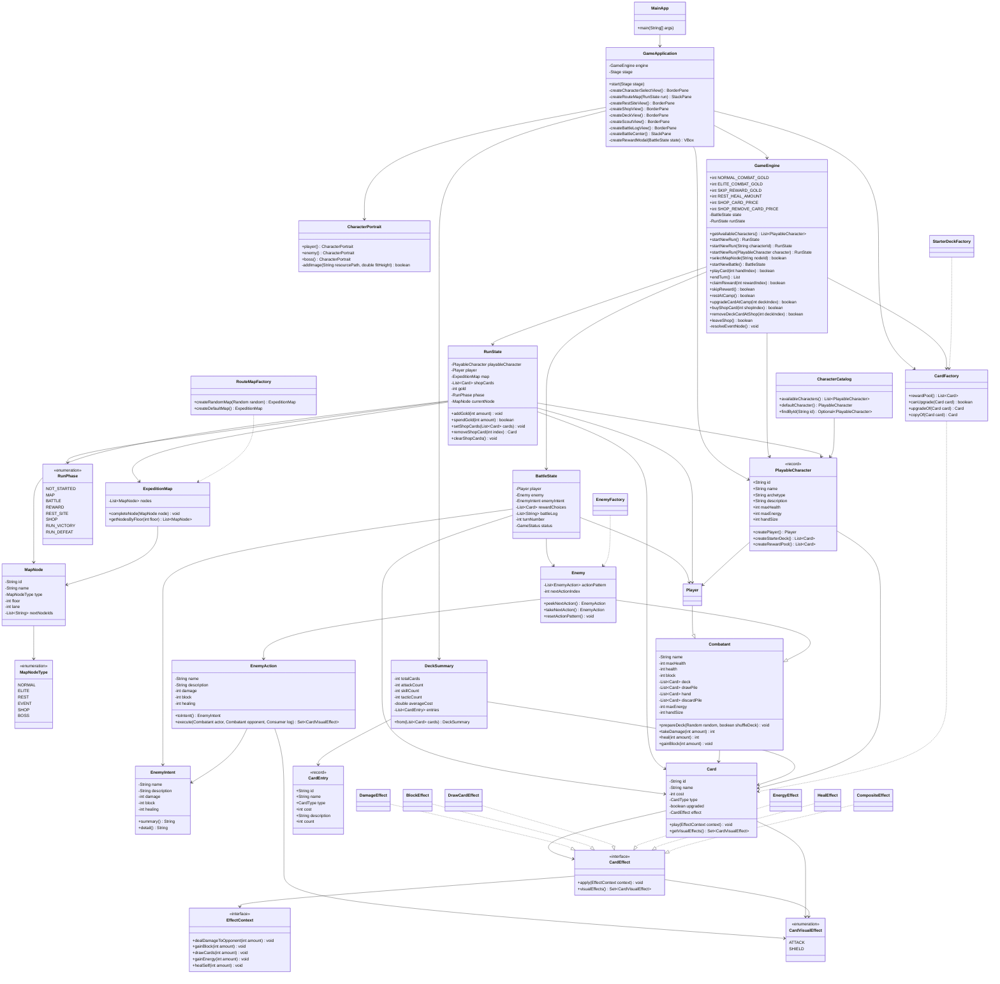

# 暗黑远征：卡牌试炼

这是一个用于 Java 编程课程展示的肉鸽卡牌战斗项目。项目玩法参考“爬塔式卡牌构筑”的通用机制，例如抽牌、能量、出牌、敌人意图、固定行动循环、回合结算和战斗奖励，但全部角色、卡牌、敌人、文本和设定均为原创，不使用《杀戮尖塔》的受版权保护内容。

当前版本已经包含一个完整的轻量肉鸽流程：主菜单点击开始远征后先进入角色选择界面，选定角色并点击“出发”后，每次远征都会随机生成 14 层长路线地图，玩家沿着连线选择节点推进，完成普通战斗、精英战斗、营地休整、特殊事件或商店采购，最终进入 Boss 节点，击败 Boss 后通关。角色配置决定本次远征的初始牌组和可获得奖励牌池；当前提供“守夜人”和“烬痕旅人”两个角色，为便于后续扩展，两个角色暂时复用同一套初始牌和奖励牌。地图、营地、商店和战斗页提供“牌组”菜单，可查看当前远征牌组的总张数、类型分布、平均费用和卡牌明细；远征状态保存金币，普通战斗胜利获得 12 金币，精英战斗胜利获得 25 金币，跳过战斗奖励额外获得 5 金币。营地提供休息恢复 18 生命或升级一张未升级卡牌，商店提供 3 张奖励池商品、35 金币购牌和 50 金币删牌服务。战斗页会直接显示敌人下一次精确意图，包括攻击、防御、治疗的具体数值。敌人不再从牌组随机释放卡牌，而是按自身固定行动表循环行动；不同敌人的差异主要由行动表节奏、数值和生命值决定。主界面不再保留右侧记录栏；战斗日志只在进入战斗后从顶部菜单打开，战斗胜利奖励在战场中央弹窗选择或跳过。战斗界面采用“上方状态栏、中间战场、底部手牌栏”的卡牌战斗布局，并从战斗背景资源清单中随机选择背景图，使用项目内原创透明 PNG 立绘展示主角、通用小兵和章末 Boss。玩家打出攻击牌或敌人执行攻击行动时会在目标身上播放 PNG 打击特效并触发受击抖动，打出防御牌或敌人执行防御行动时会在出牌者身上播放护盾特效。

## 技术栈

- Java 17
- Maven
- JavaFX 21
- JUnit 5

当前版本无数据库、无缓存、无消息队列、无 Docker、无外部服务。应用程序直接在本机运行。

## 运行方法

在项目根目录 `D:\code\Project\Slay` 执行：

```bash
mvn javafx:run
```

运行测试：

```bash
mvn test
```

如果首次运行较慢，是 Maven 正在下载 JavaFX 和测试依赖。

## 玩法说明

1. 启动后先进入主菜单，点击“开始远征”进入角色选择界面。
2. 在角色选择界面选中角色，点击“出发”后进入本次远征地图；当前两个角色暂时复用同一套初始牌和奖励牌池。
3. 地图每次远征随机生成，共 14 层，节点用图标展示并通过图例区分类型；每次只能选择当前路线已解锁的节点。
4. 普通战斗和精英战斗会进入卡牌战斗界面；营地节点进入独立营地页，可选择休息恢复 18 生命或升级一张未升级卡牌；特殊事件会触发随机收益或风险；商店节点进入独立商店页，可花费金币购买卡牌或删除牌组中的一张牌。
5. 每场战斗开始时，玩家拥有 3 点能量并抽 5 张牌，当前角色起始牌组为 12 张。
6. 打出卡牌会消耗能量并触发效果，例如造成伤害、获得格挡、抽牌、回能或治疗；造成伤害和获得格挡的牌会分别播放打击或护盾特效。
7. 点击“结束回合”后，剩余手牌进入弃牌堆，敌人会按当前预告意图执行固定行动表中的下一步；敌人的行动差异由不同敌人的行动表配置决定。
8. 非 Boss 战胜利后会在战场中央弹出奖励窗口，可选择一张来自当前角色奖励池的奖励牌加入远征牌组，也可以跳过奖励并额外获得 5 金币，然后返回地图。
9. 路线尽头是 Boss 节点，击败 Boss 后本次远征通关。
10. 地图页、营地页、商店页或战斗页点击“牌组”，可以查看当前拥有的卡牌、重复张数、类型分布和平均费用；升级牌会以独立 id 统计。
11. 战斗页会直接显示敌人下一次精确意图；点击“探查”可以查看更清晰的意图详情和敌方当前状态。
12. 只有战斗页顶部会出现“战斗日志”按钮，点击后进入独立日志页面查看抽牌、出牌、伤害、敌方行动和结算记录；地图页和战斗页都不再常驻显示右侧记录面板。

## 目录结构

```text
Slay
├── pom.xml
├── PROJECT_UML.md
├── README.md
├── src
│   ├── main
│   │   └── java
│   │       └── com/course/slay
│   │           ├── MainApp.java
│   │           ├── domain
│   │           │   ├── BattleState.java
│   │           │   ├── Combatant.java
│   │           │   ├── GameStatus.java
│   │           │   ├── Player.java
│   │           │   ├── card
│   │           │   ├── character
│   │           │   ├── enemy
│   │           │   └── run
│   │           ├── engine
│   │           │   └── GameEngine.java
│   │           └── ui
│   │               ├── CharacterPortrait.java
│   │               └── GameApplication.java
│   │   └── resources
│   │       └── assets
│   │           ├── backgrounds
│   │           │   └── battle
│   │           │       ├── manifest.txt
│   │           │       ├── README.md
│   │           │       └── *.png
│   │           ├── effects
│   │           │   └── attack-slash.png
│   │           └── portraits
│   │               ├── boss.png
│   │               ├── minion.png
│   │               └── player.png
│   └── test
│       └── java
│           └── com/course/slay
│               ├── domain/card
│               └── engine
```

## 主要文件说明

- `pom.xml`：Maven 构建配置，声明 Java 17、JavaFX、JUnit 和运行插件。
- `PROJECT_UML.md`：项目主目录中的独立 UML 文档，保存当前核心类图；后续修改主要结构时应同步更新。
- `MainApp.java`：程序入口，启动 JavaFX 应用。
- `ui/GameApplication.java`：JavaFX 界面层，负责主菜单、角色选择页、随机长地图页、战斗页、营地页、商店页、牌组菜单、探查菜单、战斗日志菜单、中央奖励弹窗、通关/失败页、手牌按钮、能量和金币显示、敌人意图显示、随机战斗背景、状态刷新、卡牌视觉特效和把按钮事件转交给引擎。攻击特效使用项目内 PNG 素材叠加播放，并按出牌者选择玩家或敌人作为受击目标；防御牌会在出牌者身上播放护盾特效。地图页使用圆形图标、虚线连线和图例展示节点类型，不在节点上堆叠文字；地图页和战斗页不再常驻展示右侧记录面板，探查和战斗日志入口只在战斗页顶部显示。
- `ui/CharacterPortrait.java`：统一封装战斗立绘显示，优先加载 `assets/portraits/player.png`、`minion.png`、`boss.png` 三张项目内原创透明 PNG；如果资源缺失，则回退到 JavaFX Shape 绘制的简易备用立绘。
- `src/main/resources/assets/portraits/player.png`：主角“守夜人”透明 PNG 立绘，用于玩家战斗单位。
- `src/main/resources/assets/portraits/minion.png`：普通敌方小兵透明 PNG 立绘，可复用于普通战斗和精英战斗的无差异敌人。
- `src/main/resources/assets/portraits/boss.png`：章末 Boss“余烬审判者”透明 PNG 立绘，Boss 节点战斗时自动使用。
- `src/main/resources/assets/backgrounds/battle/`：战斗背景图目录，`manifest.txt` 决定随机池，`README.md` 说明如何添加或替换背景图。
- `src/main/resources/assets/effects/attack-slash.png`：攻击牌命中目标时播放的透明 PNG 打击特效素材。
- `engine/GameEngine.java`：战斗流程门面，负责按所选角色开始远征、选择地图节点、开始战斗、玩家出牌、敌方意图预告、敌方固定行动表执行、结束回合、抽牌洗牌、胜负判断、按当前角色奖励池生成奖励、跳过奖励、金币结算、营地休息/升级、特殊事件、商店购牌/删牌和离店结算。
- `domain/BattleState.java`：保存一场战斗的流程状态，包括玩家、敌人、敌方当前精确意图、回合数、日志、奖励和胜负状态；玩家牌堆、手牌和能量由角色模板保存。
- `domain/Combatant.java`：玩家和敌人共用的战斗角色模板，统一保存生命、格挡、牌组、抽牌堆、手牌、弃牌堆、能量、每回合抽牌数和通用受伤/治疗/格挡逻辑。
- `domain/Player.java`：主角类型，继承 `Combatant`，由玩家通过界面操作出牌。
- `domain/card/Card.java`：卡牌数据对象，包含费用、类型、描述、升级标记、效果策略和视觉特效元数据入口。
- `domain/card/DeckSummary.java`：牌组统计模型，用于计算总张数、攻击/技能/战术数量、平均费用和同名卡牌数量，供牌组菜单展示。
- `domain/card/CardEffect.java`：卡牌效果策略接口，除了执行效果，也可声明该效果对应的视觉特效类型。
- `domain/card/CardVisualEffect.java`：卡牌视觉特效类型枚举，当前包含攻击打击和护盾。
- `domain/card/EffectContext.java`：卡牌效果执行上下文，向效果对象暴露对手伤害、自身格挡、抽牌、回能、治疗和日志能力，使玩家卡牌效果和战斗状态解耦。
- `domain/card/effects/*`：攻击、防御、抽牌、回能、治疗、组合效果等具体策略实现。
- `domain/card/CardFactory.java`：集中创建卡牌，当前包含起始牌、奖励牌、多种复合效果卡牌和所有显式升级版本，并提供 `canUpgrade`、`upgradeOf`、`copyOf` 统一处理升级和复制。
- `domain/card/StarterDeckFactory.java`：创建 12 张初始牌组，并提供按角色命名的初始牌组入口；当前两个角色暂时复用同一套实现。
- `domain/character/PlayableCharacter.java`：可选角色配置，保存角色 id、名称、定位、生命、能量、手牌数、初始牌组工厂和奖励池工厂。
- `domain/character/CharacterCatalog.java`：集中登记可选角色；后续新增角色或替换某个角色的初始牌、奖励池时优先修改这里和对应牌组工厂。
- `domain/enemy/Enemy.java`：敌人类型，继承 `Combatant`，持有固定行动表和当前行动下标，支持预览下一步和推进行动循环。
- `domain/enemy/EnemyAction.java`：敌人行动模型，保存行动名称、描述、伤害、格挡、治疗和视觉特效元数据，并负责执行行动。
- `domain/enemy/EnemyIntent.java`：敌人意图展示模型，由行动生成，用于战斗页和探查页显示精确的攻击、防御、治疗数值。
- `domain/enemy/EnemyFactory.java`：集中创建普通敌人、精英敌人和 Boss，并为不同敌人配置固定行动表；精英和 Boss 使用更高数值和更长行动循环。
- `domain/run/RunState.java`：保存一次远征的所选角色、玩家、地图、当前节点、远征阶段、金币、当前商店商品和远征日志；远征牌组直接保存在玩家角色模板中。
- `domain/run/ExpeditionMap.java`：保存地图节点集合，并负责完成节点后解锁下一层可选路线。
- `domain/run/MapNode.java`：地图节点，包含节点名称、类型、层级、横向轨道、连接节点和完成/可选状态。
- `domain/run/MapNodeType.java`：地图节点类型枚举，当前包含普通战斗、精英战斗、营地、特殊事件、商店和 Boss，并提供图例展示文本。
- `domain/run/RouteMapFactory.java`：随机创建默认 14 层远征地图，包含多入口、多分岔、虚线连接、营地、事件、商店、精英和 Boss 节点。
- `src/test/java/*`：核心领域逻辑单元测试，不依赖 JavaFX 渲染。

## UML 类图



主目录中的 `PROJECT_UML.md` 保存同一份当前项目 UML 图，便于课程提交时单独查看。

## 面向对象设计说明

- 分层思想：`ui` 只处理界面，`engine` 处理流程编排，`domain` 保存业务对象和规则。
- 角色配置驱动：`PlayableCharacter` 保存角色基础属性、初始牌组工厂和奖励池工厂，`CharacterCatalog` 负责集中登记可选角色；`GameEngine` 开始远征、战斗奖励、商店商品和事件收益都会从当前角色配置读取牌池。
- 角色模板统一：`Combatant` 是玩家和敌人的共同战斗模板，双方都拥有生命、格挡和受伤/治疗/格挡等通用逻辑；玩家由界面按钮触发卡牌，敌人由固定行动表驱动并在玩家回合开始时预告下一步。
- UI 组件化：`GameApplication` 负责整体界面编排、手牌交互、探查菜单和卡牌特效播放，`CharacterPortrait` 专门负责立绘加载和备用绘制；战斗界面根据当前节点类型自动切换通用小兵立绘或 Boss 立绘。
- 资源内聚：生成的立绘保存在 `src/main/resources/assets/portraits`，战斗背景保存在 `src/main/resources/assets/backgrounds/battle`，生成的攻击特效保存在 `src/main/resources/assets/effects`，由 Maven 打包进应用，不依赖外部图片路径；战斗背景通过 `manifest.txt` 维护随机池，便于后续替换和追加资源。
- 随机地图生成：`RouteMapFactory` 使用传入的 `Random` 生成 14 层长路线地图，`MapNode.lane` 决定节点在地图中的横向位置，`nextNodeIds` 描述路线连线。
- 图例化地图 UI：地图节点按钮只显示类型图标，节点名称和状态放入悬浮提示；图例解释普通战斗、精英战斗、营地、特殊事件、商店和 Boss，避免地图被长文字撑开。
- 信息菜单化：牌组、探查和战斗日志都作为独立菜单页面展示，避免战斗主界面长期堆叠信息；其中探查和战斗日志只在战斗阶段可从顶部菜单进入，地图页和战斗页不再显示右侧常驻记录栏。
- 奖励弹窗化：非 Boss 战胜利后由 `createRewardModal` 在战场中央显示奖励选择，领取后再返回地图，避免奖励信息长期占用主战斗界面。
- 状态驱动流程：`RunState` 使用 `RunPhase` 表示地图、战斗、奖励、营地、商店、通关和失败等阶段，UI 根据阶段切换主菜单、地图、战斗、营地、商店和结算界面；非战斗节点也先进入对应阶段，由 `GameEngine` 在玩家选择后完成节点。
- 牌组统计模型：`DeckSummary` 将牌组统计从 UI 中拆出，避免界面层直接承担卡牌聚合逻辑；升级牌和未升级牌按不同 id 统计，便于商店删牌和后续筛选扩展。
- Strategy 模式：`CardEffect` 是卡牌效果策略接口。新增卡牌效果时，只需要新增实现类或组合已有策略；如果需要战斗动画，则在效果实现中返回对应的 `CardVisualEffect`。
- 效果上下文：`EffectContext` 将卡牌效果和战斗状态解耦，新效果通过上下文请求对手伤害、自身格挡、抽牌、回能或治疗。
- Factory 模式：`CardFactory`、`StarterDeckFactory`、`EnemyFactory` 统一创建对象，减少 UI 和引擎中的硬编码；卡牌升级通过 `CardFactory.upgradeOf` 显式映射到对应 `+` 版本，避免运行时临时改数值。
- 门面模式：`GameEngine` 对 UI 暴露少量高层方法，UI 不需要知道玩家抽牌、敌方行动表推进等内部细节。
- 组合思想：`CompositeEffect` 可以把多个效果组合成一张卡，例如“获得格挡并造成伤害”，并会聚合子效果的视觉特效。

## 测试覆盖

当前测试覆盖：

- 初始牌组数量和构成
- 战斗开始时的手牌、能量和抽牌堆
- 打出攻击牌后的能量消耗和伤害
- 格挡抵消敌方攻击行动造成的伤害
- 抽牌效果
- 回能和治疗卡牌效果
- 弃牌堆洗回抽牌堆
- 胜利、奖励生成和奖励领取
- 普通战斗和精英战斗胜利后获得固定金币
- 跳过奖励不会加牌，并额外获得金币
- 失败状态
- 敌人每回合按固定行动表执行下一步，并返回敌方行动的视觉特效元数据
- 敌方当前精确意图和敌人回合实际执行的行动保持一致
- 敌人行动不依赖卡牌费用或敌方手牌
- 敌人行动表执行到末尾后会从第一步继续循环
- 玩家和敌人共同继承同一套 `Combatant` 战斗角色模板
- 普通敌人、精英敌人和 Boss 的行动表强度差异
- 远征开始时随机生成 14 层长地图、4 个入口节点和多分岔路线
- 战斗节点胜利后返回地图并解锁连接节点
- 营地节点可休息恢复生命并继续路线
- 营地节点可升级一张未升级卡牌，升级牌不可再次升级
- 商店节点会生成 3 张商品，购牌会扣金币、加牌并移除商品
- 商店删牌会扣金币并删除指定牌，金币不足或牌组只剩 1 张时会失败
- 商店离开后完成节点并解锁后续路线
- 特殊事件的非战斗结算
- 击败 Boss 后进入通关状态
- 牌组统计中的总张数、类型分布、平均费用和同名卡数量
- 攻击、防御和复合卡牌的视觉特效元数据
- 至少两个可选角色会暴露初始牌组和奖励池
- 所选角色会决定远征初始牌组和战斗奖励池
- 当前所有卡牌都有显式单次升级版本

执行：

```bash
mvn test
```

## 后续开发阶段

1. 下一阶段：加入基础遗物系统，让精英战斗或特殊节点提供被动能力奖励。
2. 后续阶段：扩展事件选项、更多卡牌效果、更多敌人类型、简单存档和更丰富的商店商品池。
3. 展示优化阶段：强化地图背景细节、更多卡牌动效、课程答辩材料和测试覆盖。

## 扩展建议

- 新增角色：先在 `StarterDeckFactory` 中添加该角色的初始牌组工厂，再在 `CharacterCatalog` 中登记新的 `PlayableCharacter`，配置角色名称、基础属性、初始牌组工厂和奖励池工厂。
- 调整角色可获得卡牌：优先在 `CharacterCatalog` 中为对应角色替换 `rewardPoolSupplier`；如果需要全新卡牌，先在 `CardFactory` 中添加卡牌创建方法、升级版本和 `copyOf` 分支。
- 新增卡牌：在 `CardFactory` 中添加创建方法和对应升级版本，如果需要新效果，则在 `domain/card/effects` 下新增 `CardEffect` 实现；如果该效果需要专属动画，先扩展 `CardVisualEffect`，再在 `GameApplication` 中补充对应播放逻辑。
- 新增牌组展示字段：优先扩展 `DeckSummary`，再在 `GameApplication` 的牌组菜单中展示。
- 新增敌人：在 `EnemyFactory` 中创建新的 `Enemy`，配置生命值和固定行动表；敌方 AI 会按行动表循环执行并提前展示下一步意图。
- 新增地图节点：在 `RouteMapFactory` 中添加 `MapNode`，并通过 `nextNodeIds` 配置路线连接。
- 新增流程：优先扩展 `GameEngine` 和 `RunState`，避免让 JavaFX UI 直接修改战斗或远征细节。
- 新增存档：首选文件存储或 SQLite；只有确实需要多用户、复杂查询或服务端部署时，再考虑数据库服务。

## 常见问题

- `mvn javafx:run` 下载依赖慢：检查 Maven 网络配置或本地镜像源。
- 端口冲突：本项目不是 Web 服务，不占用端口。
- 数据库连接失败：当前版本没有数据库，不需要启动 MySQL、PostgreSQL、Redis 等服务。
- Docker 启动失败：当前版本不使用 Docker，也没有 `docker-compose.yml`。
